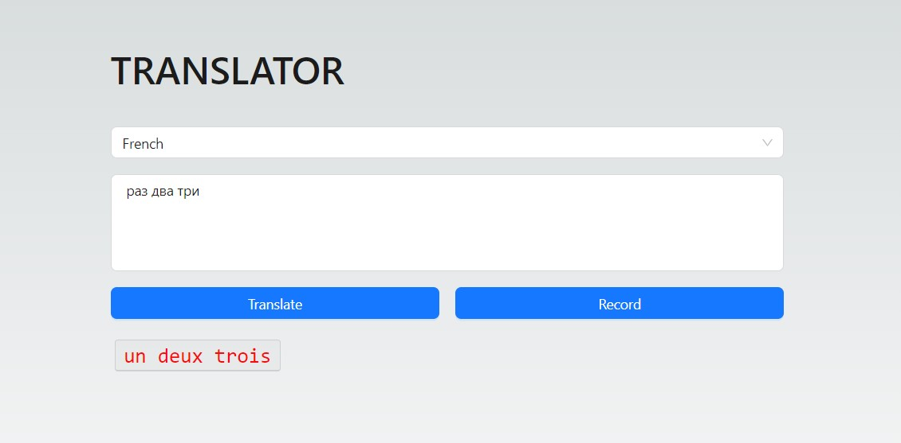

# Translator Application

This project is a language translation application built with Next.js. It allows users to input text, record speech, and translate the text into a selected language. The translation is performed using the Google Translate API, and the translated text can be played back using the Web Speech API.

## Features

Text input for translation.

Speech recognition for real-time voice input.

Language selection from a wide range of languages.

Translation using the Google Translate API.

Speech synthesis for playing back the translated text.

## Technology stack

Next.js, Speech API(not well supported by now), Google translate API(may be out off limits) AntD
